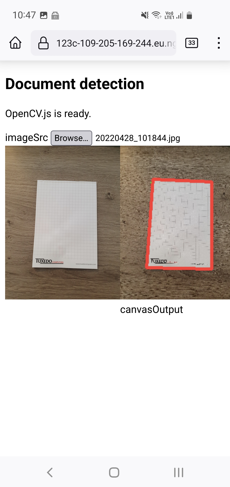
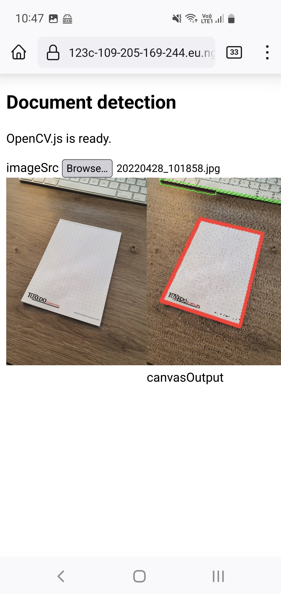
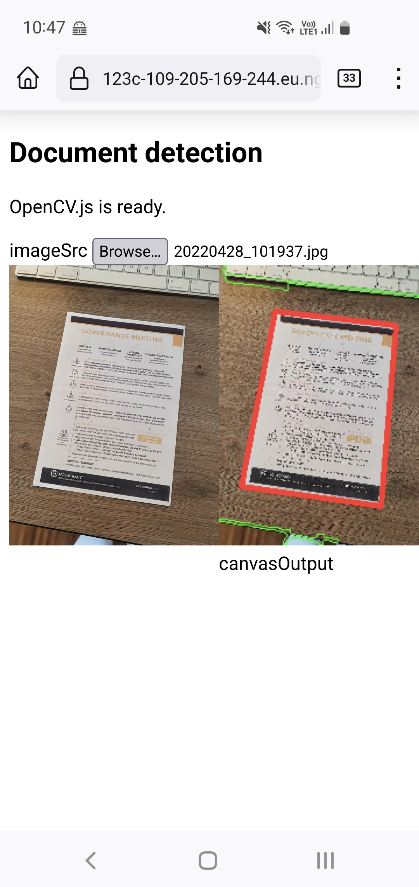

# Prototype: Document Scanner im Browser

## Screenshots

## Anwendung starten

1. `run.sh` ausführen.
2. Mit einem Browser den lokalen Webserver auf http://localhost:8080/ aufrufen.

## Wie es funktioniert

Die App läuft komplett im Browser.
Die Open-Source Library opencv übernimmt den KI-Teil.
Zum Erkennen des Dokuments passieren grob folgende Schritte:

1. Bild vorbearbeiten (schwarz/weiss, Unschärfe einfügen)
2. Kanten im Bild hervorheben
3. Zusammenhängende Konturen finden
4. Grösstes Rechteck auswählen
5. Gewähltes Rechteck auf ursprünglichem Dokument einzeichnen